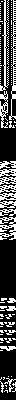
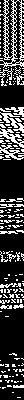
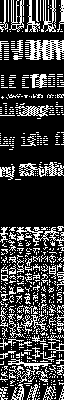
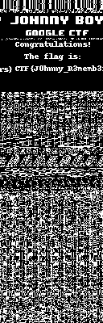

# Intro

This is my writeup for GoogleCTF 2017 `JohnnyBoy` challenge.

What we start with:

- [https://youtu.be/Dem8Fq6hkAw](https://youtu.be/Dem8Fq6hkAw) - a short movie showing someone playing JohnnyBoy on a Arduboy. We see a small portable game console with a monochrome LCD screen. The game has a nice image as intro screen.
- A file named `chall.ino.hex`

# Decoding the file

The file contains lines like:

```
:100000000C9465070C948D070C948D070C948D0748
:100010000C948D070C948D070C948D070C948D0710
:100020000C948D070C948D070C94EA130C942D15E9
...
:0C3E0200A71700C18081000000256400AB
```

It seems the '*.ino.hex' format is standardized. Sourcecode for decoding is available on [Github](https://github.com/ksksue/PhysicaloidLibrary/blob/fc259378f3aefb786ca145a139825cbd69d54fb0/PhysicaloidLibrary/src/cz/jaybee/intelhex/IntelHexParser.java).

With this knowledge we know the format:

- each line starts with `:`
- next comes a series of hex-encoded bytes
- 1st byte is the data length (every line has 5 bytes overhead)
- 2nd + 3rd byte is the data offset
- 4th byte contains the type (we can ignore this)
- 5th until last but one byte is the data
- last byte is the crc (lets assume the file is non-corrupt)

Following script creates a binary version of the ino.hex file.

```
#!/usr/bin/env python
import binascii

with open('chall.ino.hex') as f:
  with open('chall.ino', 'w') as out:
    while 1:
      line = f.readline()
      if line == '':
        break
      line = line.strip().lstrip(':')
      bytes = binascii.unhexlify(line)
      # datalen = ord(bytes[0])
      address = (ord(bytes[1]) << 8) + ord(bytes[2])
      data = bytes[4:len(bytes)-1]
      out.seek(address)
      out.write(data)
```

The result is a 15886 byte file with sha1sum:

```
816d987c8c5e53c48e2e80efcb53635d1ad892e8  chall.ino
```

# Understanding the file

```
$ file chall.ino
chall.ino: data
```

Bummer ...

```
$ gstrings chall.ino | head -10
to start!
Press a button
~|~~p?
Game Over! Try again!
>[O[>>kOk>
&)y)&@
%?Z<
j`````
08>80
db6IV P
```

Its nice to see ASCII strings! But no `CTF{` (or case variants) can be found.

Browsing the file with `hexdump -C` shows structured / columnized data. Like:

```
00000000  0c 94 65 07 0c 94 8d 07  0c 94 8d 07 0c 94 8d 07  |..e.............|
00000010  0c 94 8d 07 0c 94 8d 07  0c 94 8d 07 0c 94 8d 07  |................|
00000020  0c 94 8d 07 0c 94 8d 07  0c 94 ea 13 0c 94 2d 15  |..............-.|
00000030  0c 94 8d 07 0c 94 8d 07  0c 94 8d 07 0c 94 8d 07  |................|
00000040  0c 94 8d 07 0c 94 36 0a  0c 94 8d 07 0c 94 8d 07  |......6.........|
00000050  0c 94 8d 07 0c 94 8d 07  0c 94 8d 07 0c 94 8a 09  |................|
00000060  0c 94 8d 07 0c 94 8d 07  0c 94 8d 07 0c 94 8d 07  |................|
```

and

```
00000340  00 00 0f 00 00 00 00 c0  06 00 c0 00 00 03 00 00  |................|
00000350  00 00 1b 3b 63 7b b9 fe  c6 39 f7 8e d8 f3 00 00  |...;c{...9......|
00000360  00 00 18 6d b6 ce ec c6  c6 6c c1 9b 6d c3 00 00  |...m.....l..m...|
00000370  00 00 18 6d b6 cc 3c c6  c6 3c c1 9b 6c f3 00 00  |...m..<..<..l...|
00000380  00 00 1b 6d b6 cc 6c d6  c6 6c d9 9b 6c 38 00 00  |...m..l..l..l8..|
00000390  00 00 0e 39 b3 de 7e 73  ff fe 77 ee 6d f3 00 00  |...9..~s..w.m...|
000003a0  00 00 00 00 00 c0 00 00  00 00 00 00 00 00 00 00  |................|
000003b0  00 00 00 00 07 80 00 00  00 00 00 00 00 00 00 00  |................|
```

With the Youtube video in the back of my head (with the nice bitmap) and these data structures, I realize these might be the bitmaps.

Can we visualize these bitmaps? Yes we can!

With `convert -depth 1 -size <width>x<height> gray:chall.ino out.png` we can create a viewable monochrome image based on our binary.

Now we need to find the correct width, so I created following script to create images with differents widths making visual inspection easy. All widths are a multitude of 8 as each byte represents 8 pixels.

```
#!/bin/sh

for x in {1..32}; do
  size=$(( $x * 8 ))
  size_pad=$( printf %04d $size )
  outdir=$size_pad
  [ -d "$outdir" ] && rm -rf $outdir
  mkdir $outdir
  convert -depth 1 -size ${size}x400 gray:chall.ino $outdir/${size_pad}-out.png
done
```

So I started to browse thru the set of images. Each image gets wider and all of a sudden I saw something in the 64 pixel width image.

16px  24px  32px  64px 

And then a few images further the money shot!




# Wrap up

Thanks Google for the nice challenge. It brought back memories of `C=64` sprites.

And that hint 'without IDA' was so true!
